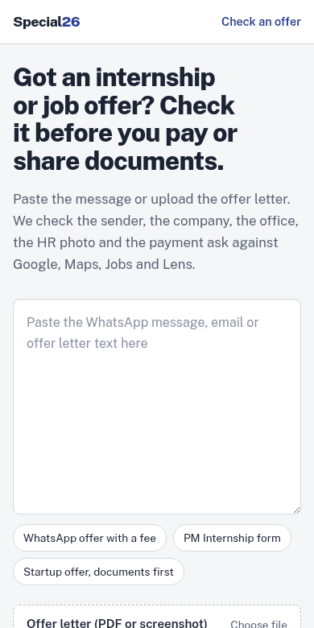

# Special26

**Check an internship or job offer before you pay or share documents.**

Indian students keep receiving offers that borrow the name of a real employer or a government scheme, then ask
for ₹499, ₹2,000 or a "refundable" deposit. Special26 takes the offer apart into checkable claims (who it says it
is from, who sent it, the office, the role, the HR photo, the payment ask). It then checks each claim against what
Google Search, Google Maps, Google Jobs, Google Lens, Google News and Google Forums actually show. The result is a
verdict card where every reason links to the search result or rule behind it.

Built for the SerpApi India Hackathon 2026. Live: https://web-production-4b8c8.up.railway.app



The name comes from the film *Special 26* (2013), where con men pose as CBI officers and win trust because they
look official. Fake offers work the same way.

## The problem

| When | Where | What happened | Source |
|------|-------|---------------|--------|
| 2026 | Chennai | Students promised ₹15,000 a month, then told to pay ₹2,000 over UPI for a "police clearance certificate" | [Dinamalar Kalvimalar](https://www.dinamalar.com/news/kalvimalar-news-en/fraudsters-target-college-students-with-fake-internship-offers-warn-cyber-experts/57787) |
| Sep 2026 | National | Surge in internship fee demands; the AICTE National Internship Portal terms now forbid any student fee | [CareerIndia](https://www.careerindia.com/features/internship-scams-2026-how-to-spot-fake-job-offers-and-avoid-paying-fees-011-66049.html) |
| Jul 2026 | National | PIB Fact Check flags a fake "MSME internship" Google Form | [NewsX](https://www.newsx.com/india/fact-check-did-the-government-really-release-internship-forms-for-students-heres-the-truth-247978/) |
| 2026 | Jabalpur | 45 students allegedly cheated of about ₹6,000 each in a fake placement scheme | [Free Press Journal](https://www.freepressjournal.in/bhopal/45-jabalpur-students-allegedly-cheated-in-fake-job-placement-scam-extorted-of-6k-each-in-delhi-video) |
| Ongoing | Employers | Tech Mahindra: "does not charge any fee or collect any deposit from candidates" | [Tech Mahindra notice](https://careers.techmahindra.com/CPDOC/Recruitment_Fraud.pdf) |

The offers copy real letterheads and real names, so judging the writing style fails. What works is checking the
claims against the outside world: is the sender domain really the company's, does the employer's own notice say it
never charges, is the "HR manager" a stock photo, has this UPI ID already been reported.

## How it works

```
offer (text, PDF, screenshot, .eml, HR photo)
  -> claims (regex + dictionaries; the student confirms or edits them, marks their own number "This is mine")
  -> 12 probes (6 SerpApi engines + local rules + RDAP), each finding carries a receipt
  -> scorer: capped evidence families, decisive rules, tier rules, coverage
  -> verdict card + next steps + share link + campaign linking across offers
```

| Claim in the offer | Question | SerpApi engine | Probe |
|--------------------|----------|----------------|-------|
| "We are Tech Mahindra" | Which domains does the real employer use? | Google Search (knowledge graph + organic) | `P01_ENTITY` |
| Employer policy | Has the employer published a recruitment fraud notice saying it never charges? | Google Search | `P04_FRAUD_NOTICE` |
| Reputation | Are people complaining about offers in this name, or naming this sender? | Google Search, Google News, Google Forums | `P05_CHATTER` |
| UPI ID, phone, domain | Has this exact identifier already been reported? | Google Search (quoted) | `P06_IDENTIFIER_TRACE` |
| The role | Does the employer list this role? | Google Jobs | `P07_ROLE` |
| Office address | Is it a company office, a house, a coworking desk, or nothing? | Google Maps | `P08_OFFICE` |
| HR photo, letter image | Is it a stock photo or someone else's picture? | Google Lens (image upload) | `P09_IMAGE` |
| The wording | Has this sentence appeared in public warnings? | Google Search (quoted) | `P10_TEMPLATE` |

Local checks interpret the evidence:
- **`P02_SENDER`:** lookalike domains (typosquat, combosquat, TLD swap, homoglyph) against the official domains P01 found.
- **`P03_HEADERS`:** DKIM, SPF and DMARC from an uploaded `.eml`.
- **`P11_POLICY`:** fee asks, personal UPI IDs, government schemes off their portals, urgency.
- **`P12_DOMAIN_AGE`:** RDAP registration date of a non-official domain.

The verdict is a pure function of the confirmed claims, the probe results and the ruleset version. No language model
is involved in probes, scoring or reason text. A genuine offer earns green only with positive proof (an
authenticated email, or the official sender plus a Maps office or Jobs listing). Missing evidence gives amber
("could not verify"), never green.

## Run it

**Replay mode (no API key, no network):** serves recorded search results for the golden demo cases.

```bash
docker build -t special26 .
docker run -e SPECIAL26_MODE=replay -p 8000:8000 special26
# open http://localhost:8000 and use the example chips
```

**Live mode:**

```bash
docker run -e SERPAPI_API_KEY=your_key -e SPECIAL26_SHARE_SALT=$(openssl rand -base64 32) \
           -v special26-data:/app/data -p 8000:8000 special26
```

**Development:**

```bash
uv venv --python 3.11 .venv && uv pip install --python .venv -r backend/requirements.txt pytest-cov ruff
.venv/bin/pytest                               # 340 tests, offline (socket guard), about 10 s
.venv/bin/pytest backend/tests/golden          # G1..G6 in replay from data/demo.db
PYTHONPATH=backend .venv/bin/python -m special26.cli check backend/tests/golden/inputs/g1.txt --mode replay
cd frontend && npm ci && npm run build         # served by the backend from frontend/dist
PYTHONPATH=backend .venv/bin/uvicorn special26.main:create_app --factory --port 8000
```

Settings are `SPECIAL26_*` environment variables (see `docs/04-architecture.md` §9). The ones you will touch:
`SERPAPI_API_KEY`, `SPECIAL26_MODE` (`live` or `replay`), `SPECIAL26_DAILY_CREDIT_CAP`,
`SPECIAL26_CREDIT_BUDGET_PER_CHECK` (14), `SPECIAL26_SHARE_SALT`, `SPECIAL26_PUBLIC_BASE_URL`.

## Evaluation

Run `python -m eval.run_eval` (full report in [`eval/report.md`](eval/report.md), reading notes in
[`eval/notes.md`](eval/notes.md)). Intervals are 95% Wilson intervals.

**On 13 cases recorded live** (7 fraud, 6 genuine):

| System | Red precision | Red recall | False red rate | Green yield |
|--------|---------------|------------|----------------|-------------|
| Special26 (all probes) | 1.00 [0.65, 1.00] | 1.00 [0.65, 1.00] | 0.00 [0.00, 0.39] | 0.40 [0.12, 0.77] |
| B0: fee keyword rule | 1.00 [0.61, 1.00] | 0.86 [0.49, 0.97] | 0.00 [0.00, 0.39] | 0.00 [0.00, 0.43] |
| B3: Special26 local rules only | 1.00 [0.61, 1.00] | 0.86 [0.49, 0.97] | 0.00 [0.00, 0.39] | 0.00 [0.00, 0.43] |

**On all 60 cases** (30 fraud, 30 genuine), the systems that need no searches:
- **B0:** red recall 0.77 [0.59, 0.88], no false reds.
- **B3:** red recall 0.93 [0.79, 0.98], no false reds.
- Neither ever produces green.

**Ablations on the 13 recorded cases** (one engine masked, in replay):
- **Without Google Search:** red recall drops by 0.14.
- **Without Google Maps:** green yield drops by 0.20.
- **Without Google Search, green yield rises by 0.40.** For big employers, general complaint chatter and a published
  fraud notice keep genuine offers at amber. That is deliberate caution, and it is reported rather than tuned away.
- **Lens has no effect in this subset** because none of the 13 cases has an image. Lens is shown by golden case G5,
  where it finds the "HR manager" photo on pexels.com.

## Limitations

- **Small, constructed evaluation.** The SerpApi free plan (250 searches a month) allowed live recording of 13 of
  the 60 cases. All cases are constructed: fraud cases follow patterns from the cited reports, genuine cases are
  messages from real employers' real domains or fictional startups. No real student messages were used. Treat the
  numbers as a smoke test with wide intervals, not a benchmark.
- **Constructed scam corpus.** Published sources describe fake offers but rarely reprint them, so the 27 texts in
  `data/seeds/scam_templates/` are written from the cited reports. A match is shown as "a fake offer pattern
  described in a public report", never as a known circulating text.
- **Google often ignores `site:`.** Fraud notices are therefore accepted only from the employer's own domains. Where
  search returns none, Special26 falls back to the employer's own notice that we fetched and checked by hand (only
  Tech Mahindra so far), labelled as such with the date.
- **Absence is not evidence.** Small genuine companies with little web presence get amber, not green. So do big
  employers when Jobs and Maps find nothing for the specific role and city.
- **No consented real offer email yet**, so the "genuine offer with DKIM" golden case (G3) is pending.
- **English only.** OCR uses Tesseract `eng+hin` when available.
- **Demo identifiers are constructed.** The domains (`techmahindra-careers.in`, `infosys-careers.co`,
  `hcltech-hiring.in`), UPI IDs and phone numbers in the examples were checked as unregistered via RDAP where
  applicable and are not used by us. Company names belong to their owners. Special26 reports evidence of
  impersonation; it does not accuse anyone.

## Where things are

- **Design and decisions:** `docs/` (start at `docs/00-README.md`; every deviation is in `docs/DECISIONS.md`).
- **Backend:** `backend/special26` (FastAPI, SQLite).
- **Frontend:** `frontend/` (React, Vite, Tailwind).
- **Evaluation:** `eval/`.
- **Seeds:** `data/seeds/` (54 companies and 6 schemes, each official domain checked against the company's own site).

#BuiltWithSerpApi
