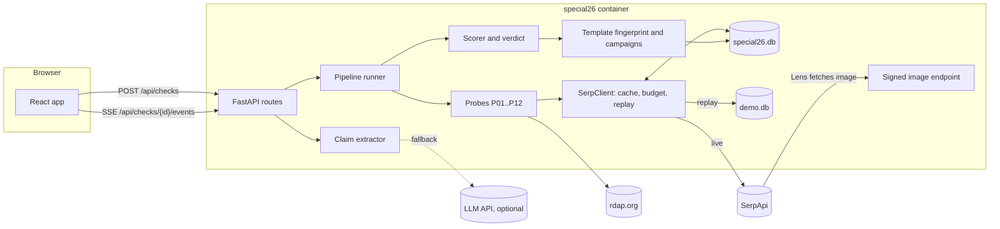
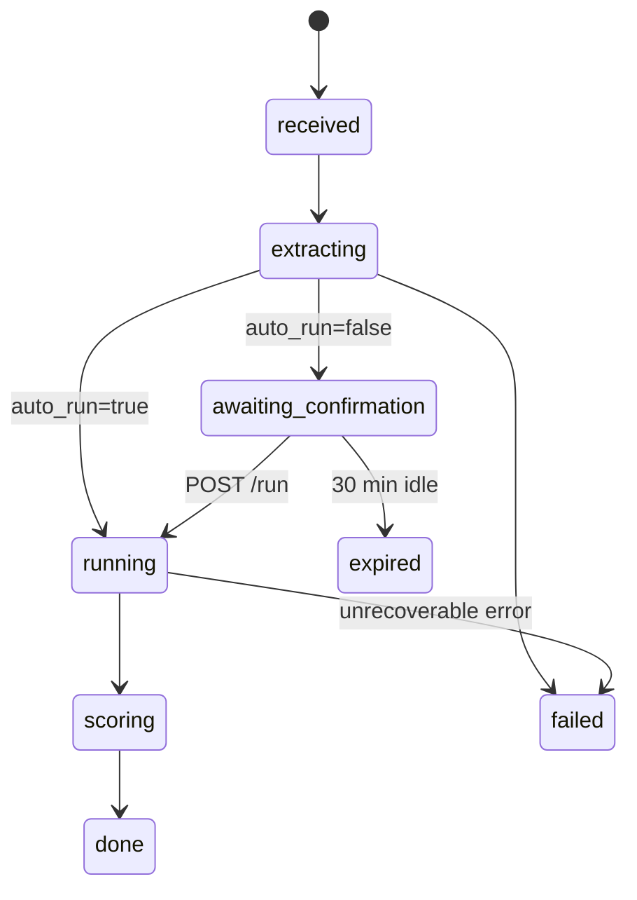
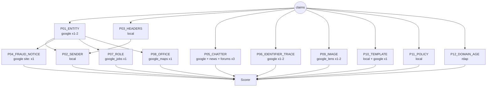
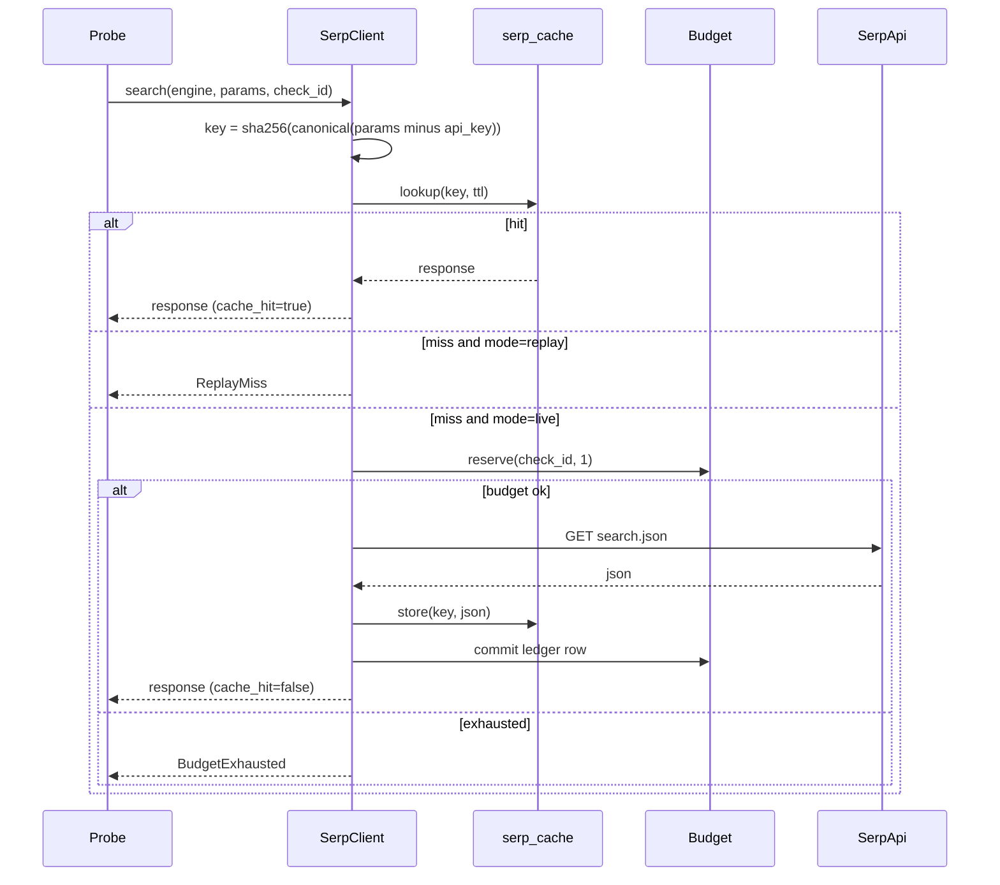

# 04. System Architecture: Special26

## 1. Shape of the system

One process, one container. FastAPI serves the API, the SSE stream and the built React app. SQLite in WAL mode holds everything. A background task per check runs the pipeline. There is no queue, no Redis and no separate worker: the expected load is a hackathon demo plus judges, and fewer moving parts means fewer demo failures.



## 2. Components

| Component | Module | Responsibility | Talks to |
|-----------|--------|----------------|----------|
| API | `special26.api` | Validation, rate limiting, file intake, SSE, share pages | Pipeline, Storage |
| Intake | `special26.intake` | PDF text and image extraction, OCR, `.eml` parsing | none (local) |
| Claim extractor | `special26.claims` | Regex and dictionary extraction, purpose classification, optional LLM fallback, redaction | Known entities seed, LLM |
| Pipeline runner | `special26.pipeline` | Orders probes, enforces timeouts and concurrency, emits events | Probes, Scorer, Events |
| Probes | `special26.probes` | Turn claims plus search results into findings | SerpClient, RDAP |
| SerpClient | `special26.serp` | Cache-first calls, budget, ledger, replay, retries | SerpApi, DB, demo.db |
| Scorer | `special26.scoring` | Family caps, decisive rules, tiers, reasons, coverage | none (pure) |
| Template and campaigns | `special26.template`, `special26.campaign` | MinHash signature, LSH lookup, union-find clustering | DB |
| Storage | `special26.storage` | SQLite access, migrations, retention job | DB |
| Frontend | `frontend/` | Intake, claim editor, live timeline, verdict card, receipts, share, campaign | API |

## 3. Check lifecycle



Terminal states: `done`, `failed`, `expired`. On reaching any terminal state, raw files and raw text are deleted (NFR-06).

## 4. Probe dependency graph



Wave 1 (parallel): `P01`, `P03`, `P05`, `P06`, `P09`, `P10`, `P11`, `P12`. Wave 2 (after `P01`): `P02`, `P04`, `P07`, `P08`. Max 4 SerpApi calls in flight at once.

Typical credit spend: P01 1.3, P04 1, P05 3, P06 1.2, P07 1, P08 1, P09 1.2, P10 1 → about 10.7 uncached calls. Budget cap 14.

## 5. SerpClient design



Cache TTL default 72 hours (`SPECIAL26_CACHE_TTL_HOURS`). Recording a replay DB = run golden cases in live mode with `SPECIAL26_RECORD_TO=data/demo.db`, which copies every response used into `demo.db`.

## 6. Image path for Google Lens

Google Lens needs a URL it can fetch (or an uploaded `image_id`). Order of preference:

1. **SerpApi image upload** (see `https://serpapi.com/google-lens-upload-an-image`): upload the bytes, receive an `image_id`, call `engine=google_lens&image_id=...`. Confirm the exact upload endpoint and response field on day 1 (task T1.6 in `13-dev-plan.md`).
2. **Signed URL fallback**: store the image under `data/uploads/{sha256}.jpg`, expose `GET /public/img/{token}` where `token = base64url(hmac_sha256(SPECIAL26_SHARE_SALT, sha256 + expiry))`, expiry 10 minutes, and pass `url={SPECIAL26_PUBLIC_BASE_URL}/public/img/{token}`. Works only when deployed on a public host.
3. Local dev without a public URL and without upload: `P09` status `skipped_no_public_url`.

Images are resized to max 1024 px on the long side and EXIF-stripped before storage.

## 7. Modes

| Mode | Network | Used for |
|------|---------|----------|
| `live` | SerpApi, RDAP, optional LLM | Real use, recording replay data |
| `replay` | None (socket guard in tests) | Demo video, judges without a key, CI, evaluation reruns |

The UI shows a small "Replay mode: recorded search results from {recorded_at}" banner in replay so nobody is misled.

## 8. Deployment

```
Dockerfile (multi-stage)
  stage 1: node:20-alpine  -> npm ci && npm run build  (frontend/dist)
  stage 2: python:3.11-slim
           apt-get install -y tesseract-ocr tesseract-ocr-hin
           pip install -r backend/requirements.txt
           COPY frontend/dist -> /app/static
           CMD uvicorn special26.main:app --host 0.0.0.0 --port 8000
```

- Host: Render or Railway free tier, one instance, persistent disk mounted at `/app/data`.
- Judges' fallback: `docker run -e SPECIAL26_MODE=replay -p 8000:8000 ghcr.io/<you>/special26` works with no key.

## 9. Configuration

| Env var | Default | Meaning |
|---------|---------|---------|
| `SERPAPI_API_KEY` | none | Required in `live` |
| `SPECIAL26_MODE` | `live` | `live` or `replay` |
| `SPECIAL26_DB_PATH` | `data/special26.db` | Main DB |
| `SPECIAL26_DEMO_DB` | `data/demo.db` | Replay source |
| `SPECIAL26_RECORD_TO` | unset | If set, copy used responses to this DB |
| `SPECIAL26_CREDIT_BUDGET_PER_CHECK` | `14` | Hard cap per check |
| `SPECIAL26_DAILY_CREDIT_CAP` | `200` | Hard cap per UTC day |
| `SPECIAL26_CACHE_TTL_HOURS` | `72` | SerpApi cache TTL |
| `SPECIAL26_PUBLIC_BASE_URL` | unset | Needed for the Lens signed URL fallback |
| `SPECIAL26_SHARE_SALT` | random at boot (warn) | HMAC key for share and image tokens |
| `SPECIAL26_LLM_PROVIDER` | `none` | `none`, `anthropic`, `openai` |
| `SPECIAL26_LLM_API_KEY` | unset | |
| `SPECIAL26_RATE_LIMIT_PER_HOUR` | `10` | Checks per IP per hour in live |
| `SPECIAL26_GL` / `SPECIAL26_HL` | `in` / `en` | SerpApi locale defaults |

## 10. Failure modes and behaviour

| Failure | Behaviour visible to the user |
|---------|-------------------------------|
| SerpApi 5xx on one engine | Probe shows "Search unavailable", coverage drops, verdict still computed |
| Budget exhausted mid-check | Remaining probes `skipped_budget`; banner "Some checks were skipped to stay within the search budget" |
| Forums engine down (known ~83% uptime) | `P05` uses Google and News results only |
| No organisation extracted | Claim editor highlights the Organisation field as required; run disabled until filled or "I don't know" is ticked (then verdict at best `grey` or `amber` unless decisive rules fire) |
| OCR missing | Ask to paste text; image still used for Lens |
| Crash inside one probe | Probe `error`, stack trace in logs only, check continues |
