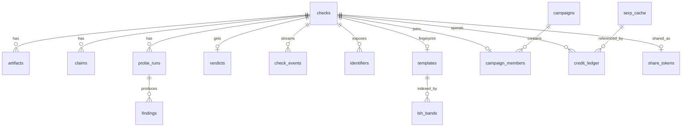

# 06. Data Model and Database Schema

SQLite 3.40+, one file `data/special26.db`. Pragmas on every connection:

```sql
PRAGMA journal_mode = WAL;
PRAGMA synchronous = NORMAL;
PRAGMA foreign_keys = ON;
PRAGMA busy_timeout = 5000;
```

All timestamps are ISO 8601 UTC strings (`2026-10-07T10:15:30Z`). All IDs are text: `chk_` + 12 lowercase base32 chars for checks, `c_` + 8 hex for claims, integers for everything internal.

## 1. Entity relationship



## 2. DDL (`backend/special26/storage/migrations/001_init.sql`)

```sql
CREATE TABLE schema_version (version INTEGER NOT NULL, applied_at TEXT NOT NULL);

-- One row per offer checked.
CREATE TABLE checks (
  id              TEXT PRIMARY KEY,                       -- chk_xxxxxxxxxxxx
  created_at      TEXT NOT NULL,
  updated_at      TEXT NOT NULL,
  status          TEXT NOT NULL CHECK (status IN
                    ('received','extracting','awaiting_confirmation','running','scoring','done','failed','expired')),
  mode            TEXT NOT NULL CHECK (mode IN ('live','replay')),
  client_ip_hash  TEXT,                                   -- sha256(ip + daily salt), for rate limiting only
  raw_text        TEXT,                                   -- NULL after terminal state (NFR-06)
  redacted_text   TEXT,
  text_sha256     TEXT,                                   -- of redacted_text, for dedupe
  auto_run        INTEGER NOT NULL DEFAULT 0,
  warnings_json   TEXT NOT NULL DEFAULT '[]',
  error_code      TEXT,
  purge_after     TEXT NOT NULL                           -- created_at + 30 days
);
CREATE INDEX idx_checks_status ON checks(status);
CREATE INDEX idx_checks_created ON checks(created_at);
CREATE INDEX idx_checks_ip_created ON checks(client_ip_hash, created_at);

-- Uploaded files. Bytes live on disk under data/uploads/, not in the DB.
CREATE TABLE artifacts (
  id            INTEGER PRIMARY KEY,
  check_id      TEXT NOT NULL REFERENCES checks(id) ON DELETE CASCADE,
  role          TEXT NOT NULL CHECK (role IN ('offer_pdf','offer_image','eml','hr_photo')),
  mime          TEXT NOT NULL,
  bytes         INTEGER NOT NULL,
  sha256        TEXT NOT NULL,
  storage_path  TEXT,                                     -- NULL once purged
  phash         TEXT,                                     -- 16 hex chars (64-bit), images only
  width         INTEGER,
  height        INTEGER,
  derived_from  INTEGER REFERENCES artifacts(id),         -- image extracted from a PDF
  created_at    TEXT NOT NULL
);
CREATE INDEX idx_artifacts_check ON artifacts(check_id);
CREATE INDEX idx_artifacts_phash ON artifacts(phash);

-- Extracted and confirmed claims.
CREATE TABLE claims (
  id          TEXT NOT NULL,                              -- c_xxxxxxxx
  check_id    TEXT NOT NULL REFERENCES checks(id) ON DELETE CASCADE,
  type        TEXT NOT NULL,                              -- ClaimType values, 08 §2.1
  value_json  TEXT NOT NULL,
  raw         TEXT NOT NULL,
  span_start  INTEGER,
  span_end    INTEGER,
  source      TEXT NOT NULL,
  confidence  REAL NOT NULL,
  confirmed   INTEGER NOT NULL DEFAULT 0,
  deleted     INTEGER NOT NULL DEFAULT 0,                 -- user removed it in the editor
  PRIMARY KEY (check_id, id)
);
CREATE INDEX idx_claims_type ON claims(check_id, type);

-- One row per probe per check.
CREATE TABLE probe_runs (
  id            INTEGER PRIMARY KEY,
  check_id      TEXT NOT NULL REFERENCES checks(id) ON DELETE CASCADE,
  probe_id      TEXT NOT NULL,                            -- P01_ENTITY ... P12_DOMAIN_AGE
  status        TEXT NOT NULL,
  credits_used  INTEGER NOT NULL DEFAULT 0,
  cache_hits    INTEGER NOT NULL DEFAULT 0,
  duration_ms   INTEGER NOT NULL DEFAULT 0,
  outputs_json  TEXT NOT NULL DEFAULT '{}',               -- e.g. official_domains, official_contacts
  started_at    TEXT,
  finished_at   TEXT,
  UNIQUE (check_id, probe_id)
);

CREATE TABLE findings (
  id             INTEGER PRIMARY KEY,
  probe_run_id   INTEGER NOT NULL REFERENCES probe_runs(id) ON DELETE CASCADE,
  check_id       TEXT NOT NULL REFERENCES checks(id) ON DELETE CASCADE,
  code           TEXT NOT NULL,                           -- P02_COMBOSQUAT etc.
  family         TEXT NOT NULL CHECK (family IN ('identity','process','reputation','artifact','existence')),
  weight         REAL NOT NULL,
  effective_weight REAL,                                  -- after 0.25x lookalike rule and probe caps
  decisive_flag  TEXT,
  message        TEXT NOT NULL,
  claim_ids_json TEXT NOT NULL DEFAULT '[]',
  receipt_json   TEXT NOT NULL                            -- Receipt model, 05 §2
);
CREATE INDEX idx_findings_check ON findings(check_id);
CREATE INDEX idx_findings_code ON findings(code);

CREATE TABLE verdicts (
  check_id            TEXT PRIMARY KEY REFERENCES checks(id) ON DELETE CASCADE,
  tier                TEXT NOT NULL CHECK (tier IN ('red','amber','green','grey')),
  red_kind            TEXT CHECK (red_kind IN ('impersonation','fee_risk')),
  score               REAL NOT NULL,
  family_scores_json  TEXT NOT NULL,
  decisive_json       TEXT NOT NULL DEFAULT '[]',
  coverage            REAL NOT NULL,
  reasons_json        TEXT NOT NULL,                      -- [{rank, code, message, finding_ids}]
  official_contacts_json TEXT NOT NULL DEFAULT '[]',
  ruleset_version     TEXT NOT NULL,
  created_at          TEXT NOT NULL
);
CREATE INDEX idx_verdicts_tier ON verdicts(tier);

-- SSE replay log.
CREATE TABLE check_events (
  check_id   TEXT NOT NULL REFERENCES checks(id) ON DELETE CASCADE,
  seq        INTEGER NOT NULL,
  type       TEXT NOT NULL,
  data_json  TEXT NOT NULL,
  created_at TEXT NOT NULL,
  PRIMARY KEY (check_id, seq)
);

-- Normalised scammer-side identifiers, for P06 local memory and campaigns.
CREATE TABLE identifiers (
  id         INTEGER PRIMARY KEY,
  check_id   TEXT NOT NULL REFERENCES checks(id) ON DELETE CASCADE,
  kind       TEXT NOT NULL CHECK (kind IN ('upi','phone','domain','email')),
  value_norm TEXT NOT NULL,                               -- upi lowercased; phone 10 digits; domain registrable; email lowercased
  domain_class TEXT,                                      -- from 08 §3, for kind = domain/email
  UNIQUE (check_id, kind, value_norm)
);
CREATE INDEX idx_identifiers_lookup ON identifiers(kind, value_norm);

-- MinHash signatures (no text stored here).
CREATE TABLE templates (
  check_id    TEXT PRIMARY KEY,                           -- or 'seed:<filename>' for seed corpus
  label       TEXT NOT NULL CHECK (label IN ('scam','genuine','unlabeled')),
  signature   BLOB NOT NULL,                              -- 128 x uint64 big-endian = 1024 bytes
  token_count INTEGER NOT NULL,
  source_url  TEXT,                                       -- seed only
  created_at  TEXT NOT NULL
);

CREATE TABLE lsh_bands (
  band_key    TEXT NOT NULL,                              -- 16 hex
  band_index  INTEGER NOT NULL,
  check_id    TEXT NOT NULL REFERENCES templates(check_id) ON DELETE CASCADE,
  PRIMARY KEY (band_key, check_id)
);

CREATE TABLE campaigns (
  id               INTEGER PRIMARY KEY,
  created_at       TEXT NOT NULL,
  updated_at       TEXT NOT NULL,
  member_count     INTEGER NOT NULL DEFAULT 0,
  orgs_json        TEXT NOT NULL DEFAULT '[]',            -- distinct claimed orgs
  edge_counts_json TEXT NOT NULL DEFAULT '{}',            -- {"upi": 3, "template": 2}
  tier_counts_json TEXT NOT NULL DEFAULT '{}',
  first_seen       TEXT,
  last_seen        TEXT,
  merged_into      INTEGER REFERENCES campaigns(id)       -- set when merged; row kept for redirects
);

CREATE TABLE campaign_members (
  check_id     TEXT PRIMARY KEY REFERENCES checks(id) ON DELETE CASCADE,
  campaign_id  INTEGER NOT NULL REFERENCES campaigns(id),
  joined_at    TEXT NOT NULL,
  via_edge     TEXT NOT NULL                               -- first edge type that linked it
);
CREATE INDEX idx_members_campaign ON campaign_members(campaign_id);

-- SerpApi response cache. Key excludes api_key.
CREATE TABLE serp_cache (
  cache_key    TEXT PRIMARY KEY,                          -- sha256 hex
  engine       TEXT NOT NULL,
  params_json  TEXT NOT NULL,
  response_json TEXT NOT NULL,
  fetched_at   TEXT NOT NULL,
  bytes        INTEGER NOT NULL
);
CREATE INDEX idx_cache_engine_time ON serp_cache(engine, fetched_at);

CREATE TABLE credit_ledger (
  id         INTEGER PRIMARY KEY,
  check_id   TEXT REFERENCES checks(id) ON DELETE SET NULL,
  engine     TEXT NOT NULL,
  cache_key  TEXT,
  cached     INTEGER NOT NULL,                            -- 1 = served from cache, no credit
  status     TEXT NOT NULL CHECK (status IN ('reserved','spent','refunded')),
  day_utc    TEXT NOT NULL,                               -- 2026-10-07
  created_at TEXT NOT NULL
);
CREATE INDEX idx_ledger_check ON credit_ledger(check_id, cached);
CREATE INDEX idx_ledger_day ON credit_ledger(day_utc, cached);

CREATE TABLE share_tokens (
  token       TEXT PRIMARY KEY,                           -- 22 chars url-safe
  check_id    TEXT NOT NULL UNIQUE REFERENCES checks(id) ON DELETE CASCADE,
  created_at  TEXT NOT NULL,
  expires_at  TEXT NOT NULL,
  view_count  INTEGER NOT NULL DEFAULT 0
);

-- Seeded reference data.
CREATE TABLE known_entities (
  id               INTEGER PRIMARY KEY,
  kind             TEXT NOT NULL CHECK (kind IN ('company','scheme')),
  name             TEXT NOT NULL,
  aliases_json     TEXT NOT NULL DEFAULT '[]',
  official_domains_json TEXT NOT NULL,
  careers_url      TEXT,
  fraud_notice_url TEXT,
  source_url       TEXT NOT NULL,                         -- where the official domain was verified
  verified_on      TEXT NOT NULL
);

-- Evaluation bookkeeping.
CREATE TABLE eval_runs (
  id            INTEGER PRIMARY KEY,
  started_at    TEXT NOT NULL,
  ruleset_version TEXT NOT NULL,
  split         TEXT NOT NULL CHECK (split IN ('dev','holdout','all')),
  mode          TEXT NOT NULL,
  metrics_json  TEXT NOT NULL,
  git_sha       TEXT
);
CREATE TABLE eval_results (
  run_id    INTEGER NOT NULL REFERENCES eval_runs(id) ON DELETE CASCADE,
  case_id   TEXT NOT NULL,
  label     TEXT NOT NULL CHECK (label IN ('fraud','genuine')),
  tier      TEXT NOT NULL,
  score     REAL NOT NULL,
  coverage  REAL NOT NULL,
  credits   INTEGER NOT NULL,
  latency_ms INTEGER NOT NULL,
  PRIMARY KEY (run_id, case_id)
);

INSERT INTO schema_version VALUES (1, strftime('%Y-%m-%dT%H:%M:%SZ','now'));
```

`demo.db` has only `serp_cache` (same DDL) plus a `recording` table: `(recorded_at TEXT, git_sha TEXT, note TEXT)`.

## 3. JSON column shapes

`claims.value_json` by type (all keys always present, null if unknown):

```json
{"type":"org","value":{"name":"Tech Mahindra","legal_suffix":"Limited","entity_id":12}}
{"type":"sender_email","value":{"address":"hr.onboarding@techmahindra-careers.in","display_name":"TechM HR Team","registrable_domain":"techmahindra-careers.in","from_headers":false}}
{"type":"upi_id","value":{"vpa":"techm.hr@ybl","handle":"ybl","handle_known":true}}
{"type":"amount","value":{"value_inr":2000,"purpose":"verification","payer":"candidate"}}
{"type":"phone","value":{"e164":"+919876543210","role":"sender"}}
{"type":"url","value":{"url":"https://forms.gle/abc","host":"forms.gle","registrable_domain":"forms.gle","kind":"form"}}
{"type":"deadline","value":{"hours":24}}
{"type":"process","value":{"no_interview":true,"chat_only_interview":false,"telegram":false,"whatsapp":true,"urgent":true}}
{"type":"scheme","value":{"scheme_key":"pm_internship"}}
```

`probe_runs.outputs_json` for `P01_ENTITY`:

```json
{"official_domains":["techmahindra.com"],
 "candidates":[{"domain":"techmahindra.com","score":5.83,"name_sim":1.0,"kg":true}],
 "official_contacts":[{"kind":"careers_url","value":"https://careers.techmahindra.com/","receipt_finding_id":101}]}
```

## 4. Seed files

`data/seeds/known_entities.json` (excerpt, verify every domain against the company's own site on day 1 and record `source_url`):

```json
[
  {"kind":"company","name":"Tech Mahindra","aliases":["TechM","Tech Mahindra Limited"],
   "official_domains":["techmahindra.com"],"careers_url":"https://careers.techmahindra.com/",
   "fraud_notice_url":"https://careers.techmahindra.com/CPDOC/Recruitment_Fraud.pdf"},
  {"kind":"company","name":"Tata Consultancy Services","aliases":["TCS","TCS iON"],
   "official_domains":["tcs.com","tcsion.com"]},
  {"kind":"company","name":"Infosys","aliases":["Infosys Limited","Infosys BPM"],"official_domains":["infosys.com"]},
  {"kind":"company","name":"Wipro","aliases":["Wipro Limited"],"official_domains":["wipro.com"]},
  {"kind":"company","name":"HCLTech","aliases":["HCL Technologies","HCL"],"official_domains":["hcltech.com"]},
  {"kind":"scheme","name":"PM Internship Scheme","aliases":["PMIS","Prime Minister Internship Scheme"],
   "official_domains":["pminternship.mca.gov.in","mca.gov.in"]},
  {"kind":"scheme","name":"AICTE Internship","aliases":["National Internship Portal"],
   "official_domains":["internship.aicte-india.org","aicte-india.org"]}
]
```

Target size: 80 companies (top campus recruiters in IT services, consulting, banks, e-commerce, Big 4, FMCG) and the 6 schemes in `08-algorithm.md` §2.4.

Other seeds: `freemail.txt` (≈ 40 domains), `aggregator_domains.txt`, `stock_photo_domains.txt`, `platform_hosts.txt`, `lure_tokens.txt`, `lexicons.yaml`, `cities.txt` (500 Indian cities with PIN prefixes), `scam_templates/*.txt` (≥ 25).

## 5. Retention

`storage/retention.py`, run at startup and every hour:

```sql
-- Raw data gone as soon as a check is terminal (normally done inline, this is the safety net)
UPDATE checks SET raw_text = NULL WHERE status IN ('done','failed','expired') AND raw_text IS NOT NULL;
UPDATE artifacts SET storage_path = NULL WHERE check_id IN (SELECT id FROM checks WHERE status IN ('done','failed','expired'));
-- (files deleted from disk before setting NULL)

-- Expire abandoned confirmations
UPDATE checks SET status = 'expired' WHERE status = 'awaiting_confirmation'
  AND updated_at < strftime('%Y-%m-%dT%H:%M:%SZ', 'now', '-30 minutes');

-- 30 day purge; identifiers, templates and campaign membership are kept only for red checks
DELETE FROM share_tokens WHERE expires_at < strftime('%Y-%m-%dT%H:%M:%SZ','now');
DELETE FROM checks WHERE purge_after < strftime('%Y-%m-%dT%H:%M:%SZ','now')
  AND id NOT IN (SELECT check_id FROM verdicts WHERE tier = 'red');
UPDATE checks SET redacted_text = NULL WHERE purge_after < strftime('%Y-%m-%dT%H:%M:%SZ','now');

-- Cache housekeeping
DELETE FROM serp_cache WHERE fetched_at < strftime('%Y-%m-%dT%H:%M:%SZ','now','-30 days');
```

Red checks keep their identifiers, template signature and campaign membership after 30 days (they protect future students), but lose all text.

## 6. Size estimates

| Table | Per check | 1,000 checks |
|-------|-----------|--------------|
| serp_cache | ≈ 11 rows x 40 KB | ≈ 440 MB (purged after 30 days) |
| findings | ≈ 12 rows x 1 KB | 12 MB |
| templates + lsh_bands | 1 KB + 32 rows | 1.5 MB |
| everything else | < 10 KB | 10 MB |

`serp_cache.response_json` is plain JSON during the hackathon so it is easy to inspect. Switch to zlib-compressed BLOBs only if disk becomes a problem.
