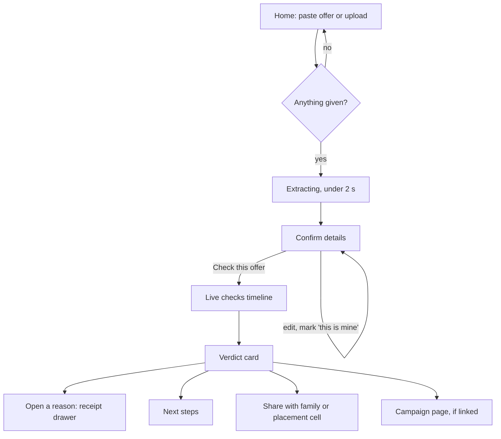

# 09. User Flow and UX

Mobile first (360 px). Most students will open Special26 from a WhatsApp link on their phone, and most share links will be opened by parents on phones.

## 1. Main flow



Target: from landing to verdict in under 60 seconds, of which about 25 are probes.

## 2. Screens

### S1. Home

- Headline: **"Got an internship or job offer? Check it before you pay or share documents."**
- Sub: "Paste the message or upload the offer letter. We check the sender, the company, the office, the HR photo and the payment ask against Google, Maps, Jobs and Lens."
- Big textarea, placeholder: "Paste the WhatsApp message, email or offer letter text here".
- Upload buttons: "Offer letter (PDF or screenshot)", "Original email (.eml)", "HR's profile photo".
- Helper under the email button: "Gmail: open the email, tap ⋮, Download message."
- Primary button: **"Check this offer"**.
- Footer line: "We never contact the sender. Your name, phone and email are removed before anything is stored."
- Three example chips that load golden cases: "WhatsApp offer with a fee", "PM Internship form", "Real offer email".

States:
- Empty submit: inline "Paste the offer text or upload a file."
- File too big: "That file is over 5 MB. Try a screenshot of the first page."
- Unsupported type: "We can read PDF, PNG, JPG and .eml files."

### S2. Confirm details

Title: **"Is this what the offer says?"**

Groups, each field editable:

| Group | Fields |
|-------|--------|
| Who is offering | Organisation, HR name, HR title |
| How they contacted you | Sender email, Reply-to, Phone numbers, Links |
| Money | Each amount with purpose and "who pays" (You / Them) |
| Process | Deadline, Interview type |
| Where | Office address |

- Fields from guesses show a yellow "Please check" badge.
- Each phone and email has a toggle **"This is mine"**. Helper: "Mark your own number and email so we don't search for them."
- If Organisation is empty: field outlined, text "Which company or scheme does the offer say it's from?" with a checkbox "The offer doesn't say".
- Primary: **"Run checks"**. Secondary: "Start over".
- Under the button: "Uses about 11 Google searches. Takes about 25 seconds."

### S3. Live checks

Title: **"Checking {org}…"**

One row per probe, appearing in order with a spinner, then a status icon:

| Probe | Row label |
|-------|-----------|
| P01 | "Finding {org}'s official website" |
| P02 | "Comparing the sender's domain with {org}'s" |
| P03 | "Reading the email's authentication" |
| P04 | "Looking for {org}'s own fraud warnings" |
| P05 | "Searching news and forums for complaints" |
| P06 | "Checking if the UPI ID, phone or domain was reported" |
| P07 | "Checking Google Jobs for this role" |
| P08 | "Checking the office on Google Maps" |
| P09 | "Checking where the HR photo appears online (Google Lens)" |
| P10 | "Checking if this letter's wording was reported" |
| P11 | "Checking the payment and process" |
| P12 | "Checking how old the domain is" |

Row end text by status: `ok` → finding count ("1 concern", "Looks consistent", "Nothing found"); `skipped_*` → grey "Skipped: {reason}"; `timeout`/`error` → "Couldn't check right now".

Small engine badge per row (Google, News, Forums, Jobs, Maps, Lens). Replay mode shows a banner: "Demo mode: using search results recorded on {date}."

### S4. Verdict card

Tier band at the top with icon and text (never colour alone).

| Tier | Icon | Headline (exact) | Sub line |
|------|------|------------------|----------|
| red, `impersonation` | ⛔ | "Strong signs of impersonation. Do not pay." | "This offer claims to be from {org}, but the evidence below says otherwise." |
| red, `fee_risk` | ⛔ | "High risk: this offer asks you to pay. Do not pay." | "Genuine employers and government internship schemes do not charge candidates." |
| amber | ⚠️ | "Could not verify this offer. Confirm through the official channel before you share documents or pay." | "Some details could not be matched to {org}." |
| green | ✅ | "Consistent with a genuine offer from {org}." | "Still confirm through {official_contact} before you share ID documents." |
| grey | ❔ | "Not enough information to judge." | "Add the sender's email, the full offer text, or the original .eml file." |

Below the band:
1. **Why** (top 3 reasons), each line tappable → receipt drawer. Each reason shows its engine badge.
2. **Evidence strength** bar: left label "Leans genuine", right label "Leans fraudulent". No percentage.
3. **Coverage** meter: "We could run 10 of 11 checks." Tapping shows the skipped ones and why.
4. **All findings** (collapsed): grouped by family with plain names: Identity, Payment and process, Reports and warnings, Images and wording, Office and role.

### S5. Receipt drawer

```
Google Search · result #1
Query:  (site:techmahindra.com) (fraud OR fraudulent OR "fake job" ...)   [copy]
Title:  Recruitment Fraud
Link:   careers.techmahindra.com/CPDOC/Recruitment_Fraud.pdf   [open]
Snippet: "... Tech Mahindra does not ask for any fee ..."
Why it matters: The employer says it never charges. This offer asks for ₹2,000.
```

For `rule` receipts: "Rule: P11_CANDIDATE_PAYS. Genuine employers do not charge candidates. AICTE's internship portal terms prohibit fees." For `local_memory`: "This UPI ID appeared in 3 earlier checks marked high risk." with a link to the campaign.

### S6. Next steps

Shown on every verdict; content depends on tier.

| Order | Step | Shown when |
|-------|------|-----------|
| 1 | "Do not pay anything or share Aadhaar, PAN or bank details." | red, amber, grey |
| 2 | "Confirm directly with {org}: {official_contact}" (link from P01/P04 receipts, never a contact from the offer) | all, if a contact exists |
| 3 | "Already paid? Call 1930 (National Cyber Crime Helpline) now. Fast reporting improves the chance of stopping the money." | red, amber |
| 4 | "Report it at cybercrime.gov.in" | red |
| 5 | "Report the call or message on Sanchar Saathi (Chakshu)" | red, if a phone claim exists |
| 6 | "Tell your placement cell" with the Share button | red, amber |

### S7. Share page `/s/{token}`

- Same verdict card, masked identifiers, no claim editor.
- Top line: "Shared from Special26. Checked on {date}."
- Bottom: "Check your own offer" button → Home.
- Open Graph tags so WhatsApp shows a preview: title = headline, description = top reason 1.

### S8. Campaign page `/campaign/{id}`

- Title: **"{n} offers linked to the same {edge}"**, e.g. "4 offers linked to the same UPI ID".
- Facts: companies impersonated (chips), first and last seen, shared identifiers (masked), template similarity.
- Member list: org, tier, date, link to share page if available.
- Copy at bottom: "Placement officers: share this page with students. It updates as more offers are checked."

## 3. Error and edge states

| Situation | What the user sees |
|-----------|--------------------|
| SerpApi daily cap reached before start | "We've hit today's search limit. Try again after 5:30 AM IST, or use the demo examples." (UTC midnight = 05:30 IST) |
| Rate limited | "Too many checks from this connection. Try again in {minutes} minutes." |
| Forwarded email uploaded | P03 row: "Skipped: this email was forwarded. Download the original to check authentication." |
| OCR unavailable | Banner on S2: "We couldn't read text from the image. Paste the text if you can. We'll still check the image itself." |
| No public URL for Lens | P09 row: "Skipped: image search not available on this server." |
| Check expired (30 min idle on S2) | "This check expired. Start again, it only takes a minute." |

## 4. Copy rules

- Never "scam", "fraudster", "fake company", "safe", "guaranteed", "100%" in headlines or reasons. The word "fraud" appears only when quoting a source ("Tech Mahindra's recruitment fraud notice").
- Every reason names the evidence source in the sentence ("Google Maps shows…", "Tech Mahindra's own notice says…").
- Masked identifiers everywhere except the private check page.
- Amounts always as "₹2,000".
- No em dashes.

## 5. Accessibility

- Tier conveyed by icon + headline text; colours: red `#B42318`, amber `#B54708`, green `#067647`, grey `#475467` on white (all ≥ 4.5:1).
- Timeline rows are a live region (`aria-live="polite"`) announcing "{label}: {result}".
- All drawers trap focus and close on Escape.
